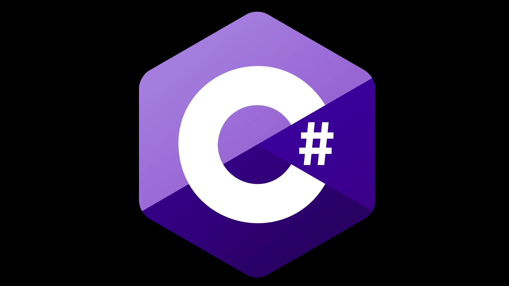
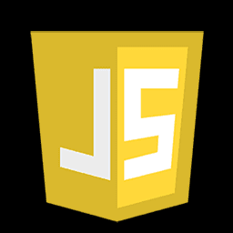
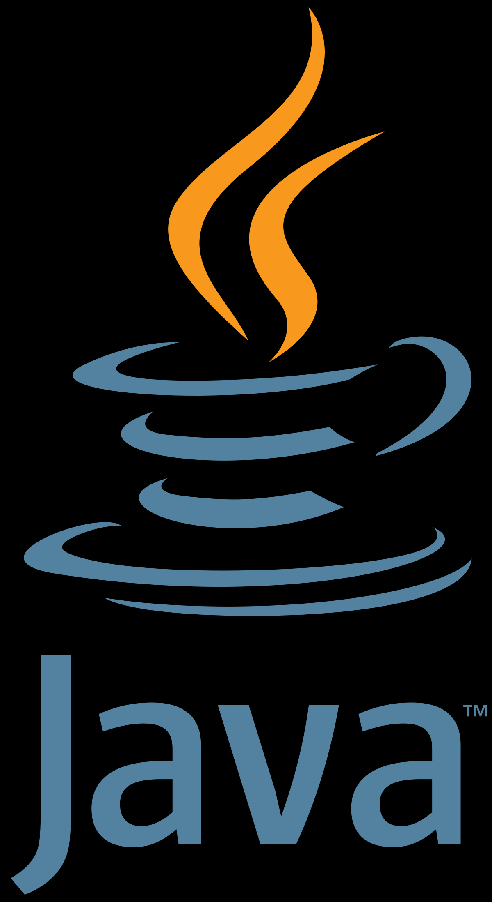
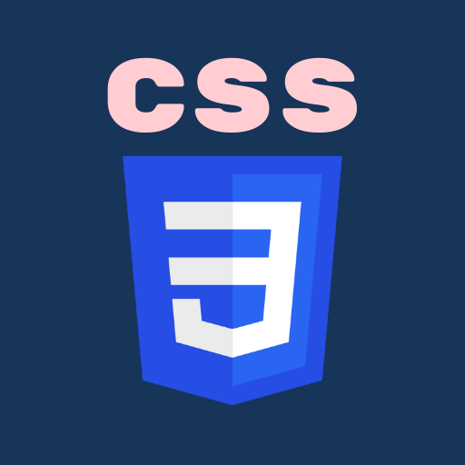

### About me

My name is Mateusz Weltrowski-Knopik. I'm 20 years old and I study computer science and Econometrics at University of Gdańsk.
I mainly work in C#, Java, HTML, CSS, SQL, Linux and Javascript.
In my free time I like to work out at the gym, do acrobatics and meet with my friends.

### Programming languages

   

  
 
### How to reach me

